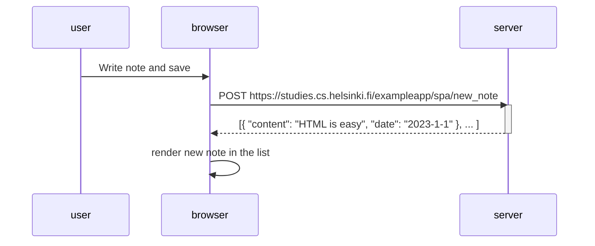

```mermaid
sequenceDiagram
    participant user
    participant browser
    participant server

    user->>browser: Write note and save

    browser->>server: POST https://studies.cs.helsinki.fi/exampleapp/spa/new_note
    activate server
    server-->>browser: [{ "content": "HTML is easy", "date": "2023-1-1" }, ... ]
    deactivate server

    browser->>browser: render new note in the list

```
